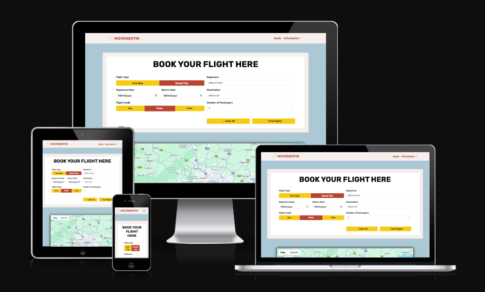
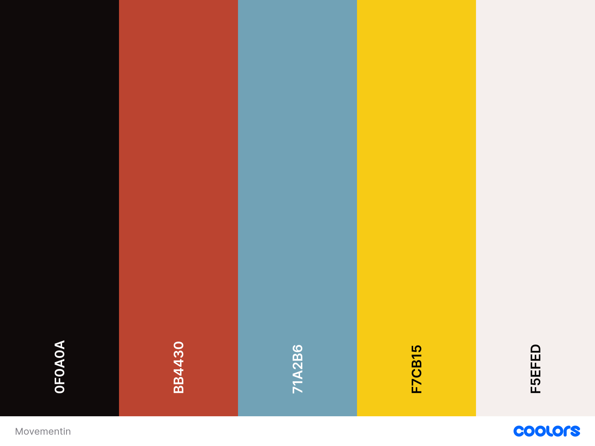
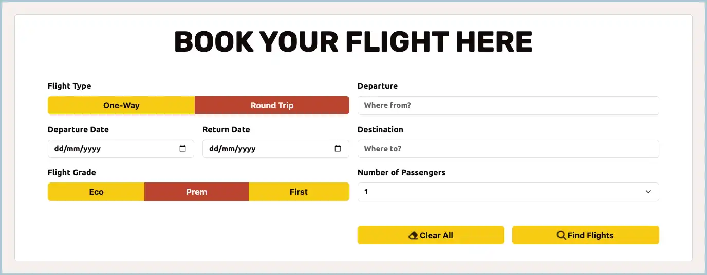
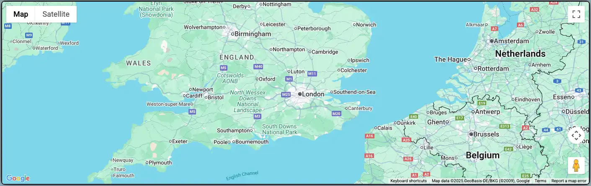
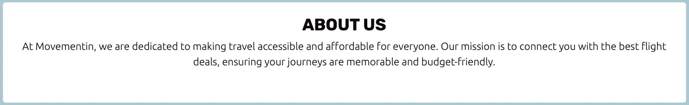
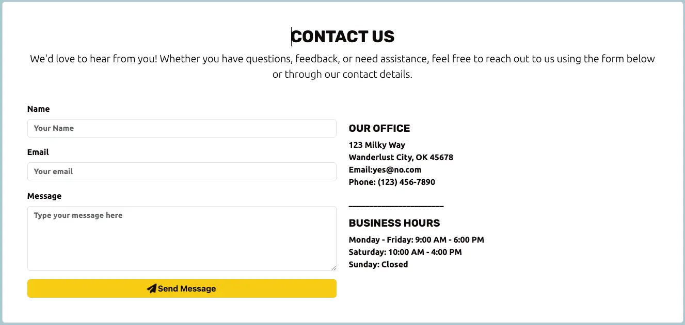
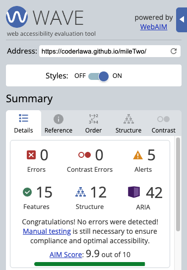
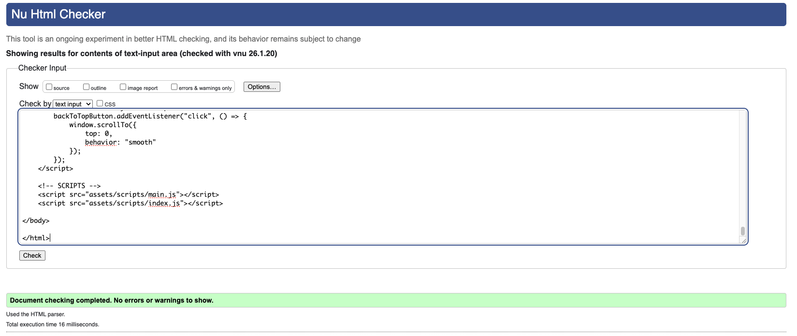
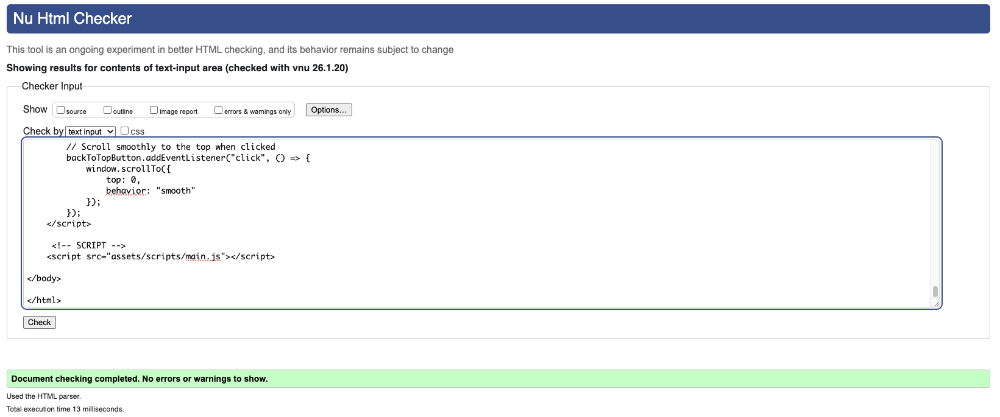
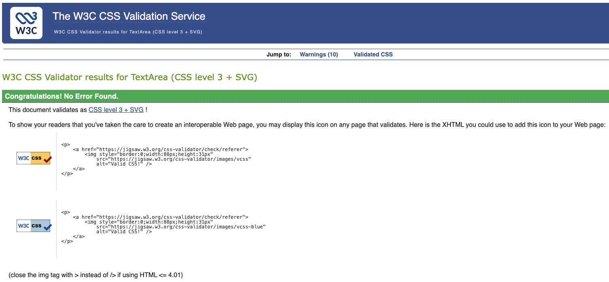

# MOVEMENTIN - Flights Planning Service

This website has been built to accomodate most visitors needs, regardless of the device used to access it - this means it is robustly responsive.

[View MOVEMENTIN on Github](https://coderlawa.github.io/mileTwo/)

## TABLE OF CONTENT

* [User Experience (UX)](#user-experience-ux)
    * [Initial Discussion](#initial-discussion)
    * [User Stories](#user-stories)

* [Design](#design)
    * [Color Scheme](#color-scheme)
    * [Typography](#typography)
    * [Imagery](#imagery)
    * [Wireframes](#wireframes)
        * [Home Page](#home-page)
        * [Profile](#profile)
        * [Portfolio](#portfolio)
        * [Contact Us](#contact)
    * [Features & Goals Solved](#features)
    * [Accessibility](#accessibility)

* [Technologies Used](#technology-used)
    * [Languages Used](#languages-used)
    * [Frameworks, Libraries & Programs Used](#frameworks-libraries--programs-used)

* [Doployment & Local Development](#deployment--local-development)
    * [Deployment](#deployment)
    * [Local Development](#local-development)
        * [How to Clone](#how-to-clone)

* [Testing](#testing)
    * [W3 Validators](#w3-validators)
    * [Solved Bugs](#solved-bugs)
    * [Known Bugs](#known-bugs)
    * [Lighthouse](#lighthouse)
    * [JSHint](#jshint)

* [Credits](#credits)

* [Conclusion](#conclusion)

* [Acknowledgement](#acknowledgement)
- - -

## User Experience (UX)

### Initial Discussion

MOVEMENTIN is meant to be a web service for finding airline tickets and holiday bundles based on a site user's desired destination, we also educate travellers about famous facts around their destination.

#### Key Info About The Site

* Real time flights search
* An interactive map for choosing destination
* Holiday bundles discovery
* A contact box for dropping messages
* Social links for further contact
* Brief information about the site's services
* Image of scenic locations scrolling continuously
* 

### User Stories

#### Client Goals

* 

#### Site Visitor Goals

* 

#### Frequent & Returning Visitor Goals

* Account creation is a future development opportunity for Movementin.

---

## Design

### Color Scheme

This website uses a palette of extremely contrasting colors for the purpose of keeping site users visually stimulated. This color scheme was sourced from [Coolors](https://coolors.co/).

### Typography

[Google Fonts](https://fonts.google.com/) has been used exclusively for all the words presented on this website. See fonts used listed below;

* Primary Font - [Rubik](https://fonts.google.com/specimen/Rubik)
* Secondary Font - [Ubuntu](https://fonts.google.com/specimen/Ubuntu)

Both fonts are backed-up by sans-serif.

### Imagery

The images on this website were sourced from [Pexels](https://www.pexels.com/) - a royalty free stock photos and videos web service.

### Wireframes

Wireframes were created for Mobile & Tablet/Desktop.

#### Home Page
* Mobile Home Page
.webp)
* Tablet / Desktop Home Page
.webp)

#### Information Page
* Mobile Information Page
.webp)
* Tablet / Desktop Information Page
.webp)

### Features

This website is made up of one main page and an information page. Both pages are divided into 3 sections in the following ways;

* INDEX PAGE: Flight Planning Form, Interactive Map & Deals sections.
    * Booking Section I.D. -
    This section contains the planning form needed by site visitors to find flights. The form allows users input their flight type (i.e. one-way / round trip), departure point, departure date, return date (if applicable), destination point, flight grade (i.e. economy, premium or first class) and number of passengers.

    This section covers [Site Visitors Goal](#site-visitor-goals).

    

    * Map Section I.D. -
    This is the section of the site where users can visualize their locations. The map has been created using the same foundation as [Google Maps](https://google.com/maps) and is highly interactive with the planning form (above) while maintaining its native features. 

    

    * Deals I.D. -
    In this section, site visitors can find holiday packages for varying locations (including their desired location). These deals may be customized to suit individual requirements.

    

* INFO PAGE: About Us, Infinite Scrolling Images & Contact Us Form.
    * About I.D. - 
    This section provides visitors with a brief overview of what MOVEMENTIN is about and touches on the business' mission.

    

    * Infinite Scrolling Images -
    This section of the info page contains scenic images that should fill site visitors heads with locations for their next holiday destination. The collection of images have made to look like they never end, thus creating the illusion of an infinite scroll. 

    

    * Contact I.D. -
    This is a form designed to give site visitors the ability to send a message to the dev. The form contains fields for full name, phone number, email, message & a submit button. A bounce animation has been added to the paper-plane icon attached to this label to draw the attention of visitors.

    

* Footer (on all pages)
    * Footer ID - 
    Contains icons connected to the following professional social platforms; Facebook, Instagram, Pinterest & X. It also contains footer text for copyright.

* Back-To-Top button (located at the BOTTOM RIGHT) for helping site visitors get back to the top of the page without needing to scroll back up. The bounce animation has been added to the icon attached to this heading to draw the attention of visitors. This feature is only appears after visitors begin scrolling down the page.

This feature has been replicated from my [Milestone One](https://coderlawa.github.io/milestoneOne/)

* JavaScrpts -
    * Google Maps API key
    * Copyright information with automatic calendar update.
    * Bootstrap script for bootstrap codes implemented into entire code body.
    * Font Awesome script for font awesome icons used in project.
    * Auto-close site menu after site user has selected an option from the navigation.
    * Back-to-top script for back-to-top button.

### Accessibility

I have adopted the best practices available for making websites usable to individuals who depend on screen-readers by making this project as accessible as possible by;

* Used semantic HTML.
* Used descriptive "alt" attributes on images.
* Ensured sufficient color contrast throughout the site.
* Added animated icons to attract the attention of users.

- - -

## Technology Used

### Languages Used

HTML, CSS & Javascript have been used to create this website and its features.

### Frameworks, Libraries & Programs Used

[Am I Responsive?](https://ui.dev/amiresponsive) - for viewing website across different screen sizes at the same time.

[Bootstrap (v5.3)](https://getbootstrap.com/) - codes for the navbar, tabs, cards and general site designing. More designing was done in the style.css file.

[Birme](https://www.birme.net/) - for converting images to .webp format.

[Balsamiq](https://balsamiq.com/) - used to create wireframes.

[Favicon](https://favicon.io/) - used for this site's favicon.

[Font Awesome](https://fontawesome.com/i) - used for all icons & their animations on the site.

Git - for version control.

[GitHub](https://github.com/) - for saving & storage of files for the website.

Google Dev Tools - used to troubleshoot & test features (including responsiveness & styles).

[Google Fonts](https://fonts.google.com/) - used for all literature on this website.

[Shields](https://shields.io/badges) - for making badges added to this README.md file.

[TinyURL](https://tinyurl.com/) - used to shorten the links added to the images of the deals section on the index page.

[SerpAPI](https://serpapi.com/) - attempted to use this to scrape the web for flights but it proved to be tedious.

[Skyscanner](https://developers.skyscanner.net/docs/getting-started/authentication) - the developer was in the process of acquiring an API key and was unable to do so in time, to meet the milestone's deadline.

- - -

## Deployment & Local Development

### Deployment

GitHub pages was used to deploy the live website. Steps followed are listed below:

1. Log in / Sign up for [GitHub](https://github.com/)
2. Selected the repository - mileTwo.
3. Clicked the Settings tab (from the top row).
4. Clicked the Pages option (on the left panel).
5. In the "Build and deployment" sub-heading, ONLY change the drop-down options under "Branch". Select "main" in the first drop-down & "root" in the second drop-down.
6. Click "Save" & the live GitHub site should provide a link to your project.

## Local Development

### How to Clone

To clone this site, do the following;

1. Log in / Sign up for [GitHub](https://github.com/)
2. Select the repository - mileTwo.
3. Click on the arrow beside the code button. Depending on your preference, select the correct tab option from either HTTPS, SSH or GitHub CLI and copy the link shown.
4. Open your IDE and follow the instructions provided to clone a project.

- - -

## Testing

Some of the following bugs were raised during a milestone catch-up call with my Mentor while, manually testing the sites scripts revealed others;

* The Return Date Group on the Flight Form remained hidden when the form was reset with the Clear All button.

* The project's URL had to be autorized manually on Google's API console in order to test the funtionality of my code. The same access had to be given to the repository's URL.

Testing this site was a synchronous process. These features were tested during development;

1. Functional Testing
    * Navigation
        * Verified all menu links worked as intended, including - About Us & Contact Us buttons

        * Ensured all buttons are clickable and provide users with some interactive feedback. Socail link button open new tabs when clicked.

    * Forms
        * All input fields in every form is properly validated.

        * Destination field is properly connected to the site's map.

        * Clicking the "Clear All" button properly resets the Flight Form.

        * Clicking the "Find Flights" button prompts users to either fill in empty fields or will retreive flight details when properly integrated.

        * The "Send Message" button on the Contact Us form firstly, validates required fields and triggers a successful submission modal to appear afterwards.

    * Content Verification
        * All texts on the are grammatically correct.

        * Images & Map load correctly and have correct alt text.

2. Usability Testing
    * Layout & Design
        * Checked for consistent layout, font usage and color scheme on all pages and modals.

        * Ensured website's designs are visually appealing and align with brand goals on all pages.

        * Tested every button provides feedback at different stages.

    * User Interaction
        * Verified interactive elements provide visual feedback when hovered / clicked.

        * Assessed the intuitiveness of the navigation and overall user flow.

3. Compatibility  Testing
    * Cross-Browser Compatibility
        * Tested the website on various browsers (Google Chrome, Mozilla Firefox, Safari, Microsoft Edge) to ensure the site maintains its integrity on these different environments.

    * Responsive Design
        * Verified the website displayed correctly on different devices, screen sizes & resolutions.

        * Checked for proper element alignment, readability and functionality on both portrait and landscape orientations.

4. Performance Testing
    * Loading Speed
        * Measured each page's loading time to ensure it meets acceptable performance standards.

    * Media Performance
        * Ensured images load correctly without degrading page performance.

5. Accessibility Testing
    * Keyboard Navigation
        * Confirmed all interactive elements are accessible via keyboard navigation.

    * Screen Reader Compatibility
        * Tested the website with screen readers (on Safari) to ensure readable content is available to users with visual challenges.

    * Color Contrast
        * Verified text and background color combinations provide sufficient contrast for readability. This was tested on  [Wave Webaim](https://wave.webaim.org).
        

6. Security Testing
    * Form Security
        * Ensured form submissions are protected against common vulnerabilities like SQL injection and cross-site scripting (XSS).  

    * HTTPS Verification   
        * Confirmed the site uses HTTPS to secure data transmission.

7. Content Testing
    * Accuracy and Relevance
        * Verified all information, including form labels and holiday deals are accurate.

    * Meta Information
        * Ensured each page has appropriate meta titles and description for SEO purposes.

### W3 Validators

The well-known [W3 HTML](https://validator.w3.org/) was used to validate the all HTML codes & [W3 CSS](https://jigsaw.w3.org/css-validator/) was used for validating all CSS codes on this project.

* INDEX PAGE

* INFO PAGE

* CSS

### Solved Bugs

1. I had an issue with the radio buttons on the flight form (i.e. Flight Type and Flight Grade) classes because they all shared the same name 
    
    * SOLUTION - Grouping elements with other similar buttons solved this problem.

2. Choosing "One-Way" button in the Flight Type made the Return Date group invisible but resetting the form with the Clear All button did not make it visible again.

    * SOLUTION - Adding code to the form reset javascript solved this issue.

3. The Flight Form Modal & Contact Us Form Modal would pop-up if the Find Flight & Send Messages buttons are clicked, respectively. This would happen even when the required fields were blank.

    * SOLUTION - Writing better codes to distinguish pages in the javascript files helped resolve these.

4. 

### Known Bugs

1. Searching for flights on the flight form prompts a browser alert rather than display results. This is because an actual flight data API has not been connected to the site - the dev is in line for a key from [Skyscanner](https://developers.skyscanner.net/docs/getting-started/authentication).

2. There is currently no pattern for the Email Input on the Contact Us form to use as a template.

### Lighthouse Test

## Credits

* The inspiration to build this website came from [LAND3](https://www.land3.net) - a different project the developer is involved in constructing.

* The technical know-how to complete the [Infinite Scroller](https://www.youtube.com/watch?v=KD1Yo8a_Qis) on the Information Page was learnt from Coding2GO on [YouTube](https://www.youtube.com).

## Conclusion

The project was visited from a wide range of browsers from different devices in order to extensively test its responsiveness and I am glad to report its has been a huge success so far. I hope you also find the website fun to navigate and interact with and if you wish to contact me, send a message here - <strong> tom.ogun@icloud.com

## Acknowledgement

I want to thank;

Graeme Taylor - my former mentor on the Code Institute programme for providing me with resources to make my experiece better.

Manuel Romero - my tutor for directing to me to all the personnel available to me during my learning and for granting an extension for me to complete course work.

I styled the placeholder on the flight form using "input::placeholder" to target the element.

I used large / larger font-size for both the navbar & btn to add more dynamism to the site.

[Autocomplete Form](https://developers.google.com/maps/documentation/javascript/legacy/supported_types#table3)

[Geocoder](https://developers.google.com/maps/documentation/geocoding/overview)

[Youtube Search](https://www.youtube.com/results?search_query=infinite+horizontal+images+scroll+html+css)